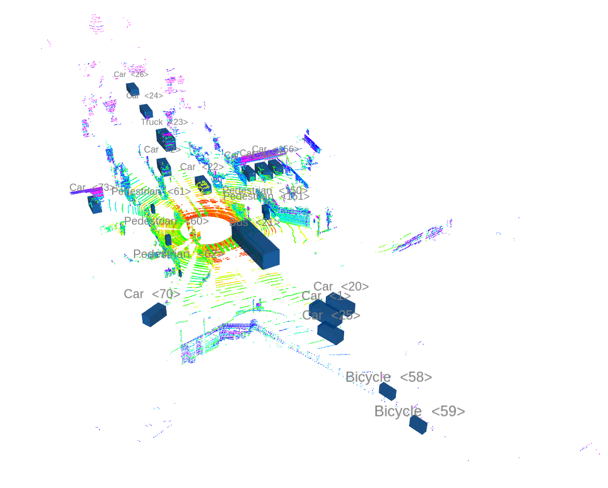

# Dataset Visualizer

## Python Requirements
```
argparse
ros_numpy
ros
pcl
pathlib
numpy
```

## Dataset tree

```
.
├── scene000
│   ├── Annotations
│   └── PCDPoints
├── scene001
│   ├── Annotations
│   └── PCDPoints
.
.
.
└── sceneXXX
    ├── Annotations
    └── PCDPoints

```

## How to use

1. Open ROS' rviz
1. Set Fixed Frame to `lidar`
1. Add PointCloud visualization, set to topic `/points_raw`
1. Add MarkerArray visualization, set to topic `/detection/object_markers`
1. Following example tree shown above execute:
```
$ python /PATH/TO/reader_publisher.py ./scene000/PCDPoints ./scene000/Annotations
```


